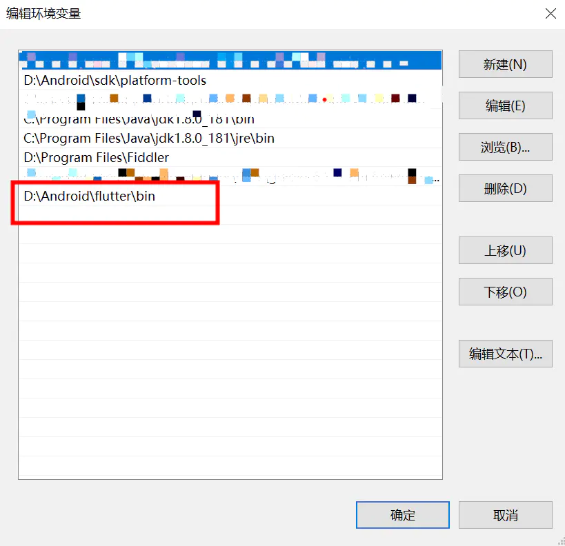
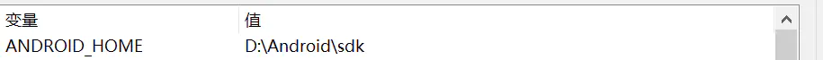
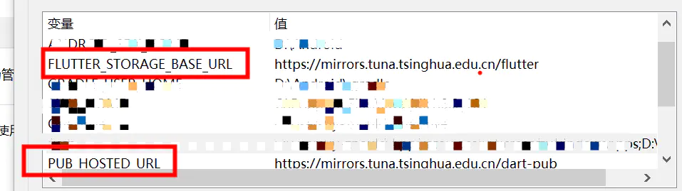
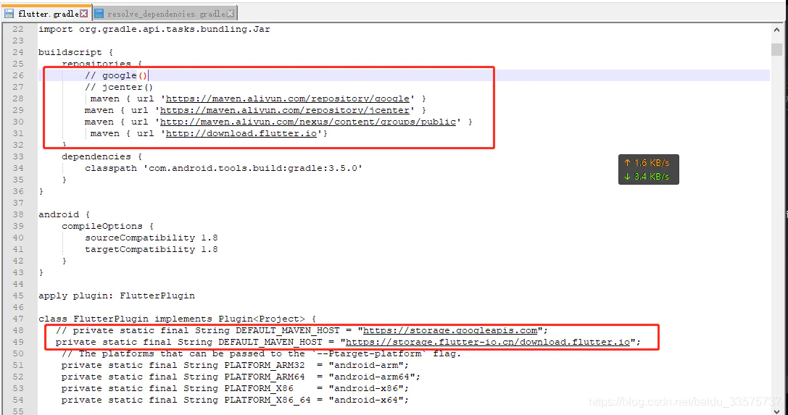
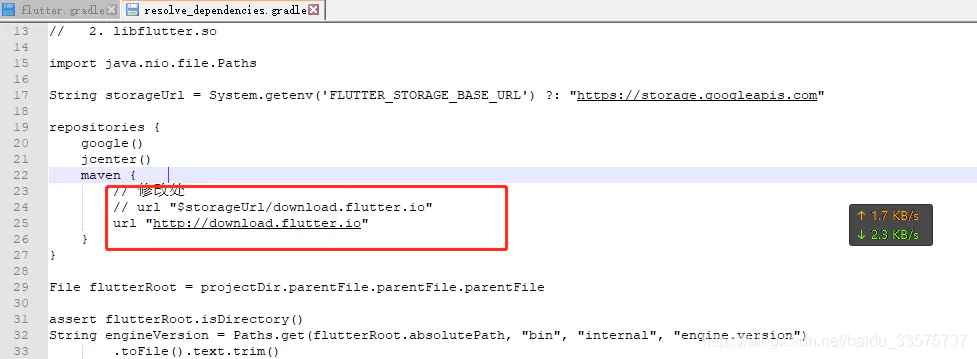
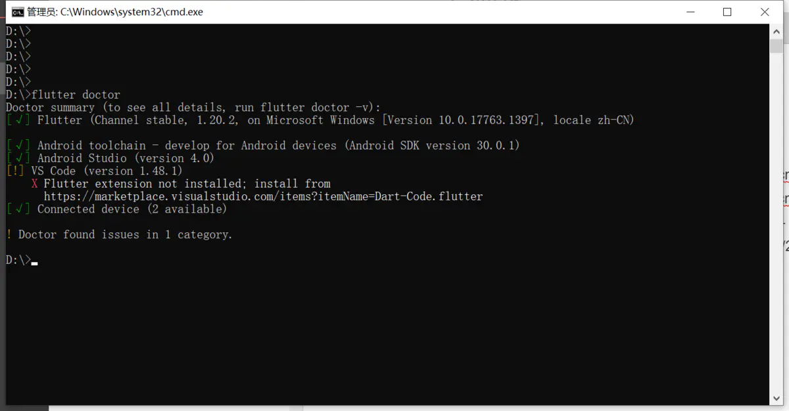

# 环境搭建

适合已经安装安卓环境的情况下，小白自己摸索。
## Window
### 一、下载sdk
  <https://flutter.dev/docs/development/tools/sdk/releases>

### 二、设置环境变量
  + 添加到Path

  + 设置ANDROID_HOME

  + 配置镜像
<https://flutter.cn/community/china>
清华镜像
PUB_HOSTED_URL                         https://mirrors.tuna.tsinghua.edu.cn/dart-pub
FLUTTER_STORAGE_BASE_URL  https://mirrors.tuna.tsinghua.edu.cn/flutter

### 三、修改flutter配置文件
修改 .\flutter\packages\flutter_tools\gradle\flutter.gradle 文件

maven { url 'https://maven.aliyun.com/repository/google' }
maven { url 'https://maven.aliyun.com/repository/jcenter' }
maven { url 'http://maven.aliyun.com/nexus/content/groups/public' }
maven { url 'http://download.flutter.io'}
private static final String DEFAULT_MAVEN_HOST = "https://storage.flutter-io.cn/download.flutter.io";

修改 .\flutter\packages\flutter_tools\gradle\resolve_dependencies.gradle 文件

url "http://download.flutter.io"

### 四、修改项目 android根目录下的build.gradle 文件，加入阿里镜像代理

### 五、运行flutter doctor

