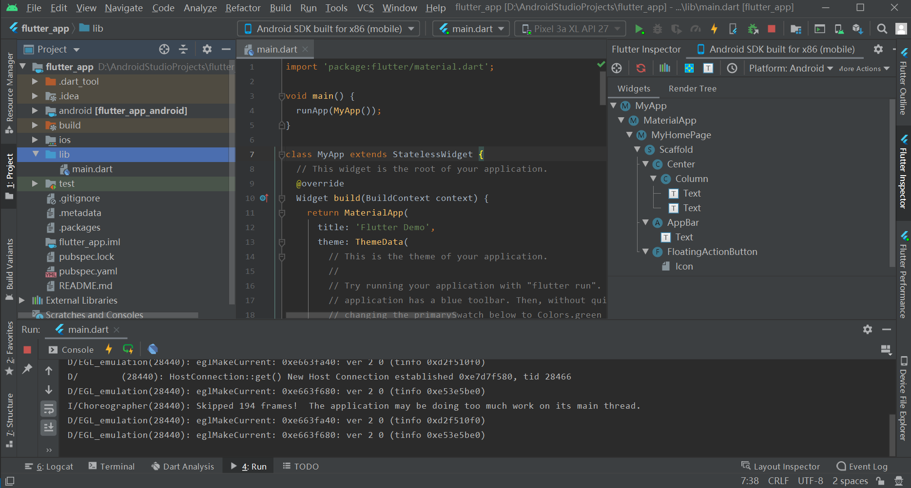

# 02开发工具
## 常用命令
flutter环境装好后，只需要个文本编辑器就可以开发出一个完整的app。flutter常用命令：

* flutter doctor：顾名思义，医生，用来检测flutter安装环境。
* flutter upgrade：将会将工具链上的工具提升到最新的版本。
* flutter create {project_name}
：创建flutter默认目录结构，一般新建工程都是那个加加的demo，如果是纯flutter工程，可以直接删除ios或android目录，运行命令可以补全，不影响项目。
* flutter packages get：比较常用的命令，拉取第三方包到本地，或者用flutter pub get代替。
* flutter run:运行项目，如果有多个项目会让你选择
* flutter emulators:罗列可用的模拟器
* flutter emulators --launch {emulator id}:打开模拟器
* flutter build {platform} {type}:打包，例如flutter build android --release

## VSCode
安装vscode就不介绍了，强烈推荐vscode，主要是轻量级，超级好用，不开发flutter也建议装一个。有点难受是画ui无法预览，需要运行到模拟器或真机上才行。

1、下载flutter、dart插件，一般来说下载flutter会自动安装dart插件。

2、打开模拟器
.png)

3、运行项目
* 打开菜单栏Run->Run Without Debuging ,或者按快捷键Ctrl+F5  
* 如果需要debug模式，Run->Start Debuging,或者按快捷键F5
* 在命令窗口输入flutter run

## Android Studio
google亲儿子，又能开发android，所以anroid开发猿不二选择。

1、照例下载插件flutter、dart，同样下载flutter会同时下载dart。如果不成功，就分开下载。下载后重启as

2、设置flutter、dart的sdk路径

3、运行项目，基本就这样了

## 小结
至于哪种开发工具更适合自己，见仁见智。如果要长期往flutter发展，还是建议使用AS，毕竟google开发的工具和平台，支持会更好。