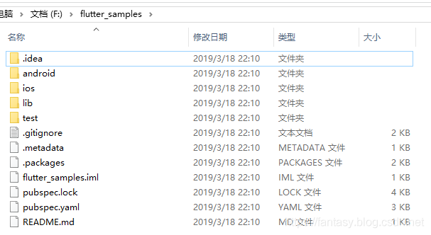

# 03开发规范
## 目录规范

默认新建项目后，官方标准的项目结构如上图所示。
* android:目录存放Android项目结构代码
* ios:目录存放ios项目结构代码；
* lib:目录存放Flutter核心的逻辑代码
* test:目录存放测试用例代码
* pubspec.yaml:配置信息基本写在这里。

这几个目录基本上是不变的。如果我们需要存放资源文件，图标、图片文件；音频视频文件；字体文件等等，我们参照官方例子，一般把项目资源文件放在项目根目录自己新建的assets目录里，如果有需要，可以在assets目录里再进行分类：如images、audios、videos、fonts等等

这里要注意的是：定义的资源文件，我们需要在pubspec.yaml进行路径配置，才可以在Flutter代码里使用。


## 命名规范
* 大驼峰法：类名称，如MainPage；
* 小驼峰法：包名、函数名，变量名、参数名；
* 查看dart源码发现，源文件名都是小写英文加上下划线组成，如app_bar.dart；
* 一般情况下，类名是源文件名的大驼峰写法，如源文件app_bar.dart，类名AppBar；源文件bottom_app_bar，类名BottomAppBar；
* 不使用前缀字母，如不推荐使用mList，可以用list，或者更加详细的命名，如bookList;
* assets目录下的资源文件名，和源文件名命名规则一样；
* 枚举类的元素，使用大写英文加下划线，如YEAR_MONTH_DAY；

## 代码规范
* import规范

  ```
  //建议 dart：包的导入要写在package:包的前面
  import 'dart:async';
  import 'dart:html';

  import 'package:bar/bar.dart';
  import 'package:foo/foo.dart';

  //建议package:包的导入要写在我们相对引用本项目类的前面
  import 'package:bar/bar.dart';
  import 'package:foo/foo.dart';

  import 'util.dart';

  //建议将自己的包内的类的引入放置在其他第三方库引入的包后面
  import 'package:bar/bar.dart';
  import 'package:foo/foo.dart';

  import 'package:my_package/util.dart';

  //建议export的引入要写在import引入的后面
  import 'src/error.dart';
  import 'src/foo_bar.dart';

  export 'src/error.dart';

  //同级别的引用排列顺序最好按照字母的顺序进行排列
  import 'package:bar/bar.dart';
  import 'package:foo/foo.dart';

  import 'foo.dart';
  import 'foo/foo.dart';

  ```
* if else使用大括号，尽可能不省略，但是如果一个控制语句只有if，没有else的话，可以不使用{}。
* 不要使用new；
* page页面中（StatelessWidget、StatefulWidget）尽量将每一层和每一个widget以单独函数形式调用，层次清晰分明（工具类封装的Widget可例外）；
* 封装简单常用的widget，注意使用@required、assert
```

  /*
  *  生成常用的AppBar
  */
  static Widget buildAppBar(BuildContext context, String text,
      {double fontSize: 18.0,
      double height: 50.0,
      double elevation: 0.5,
      Widget leading,
      bool centerTitle: false,
      List<Widget> actions,
      OnItemDoubleClick onItemDoubleClick}) {
    return PreferredSize(
        child: GestureDetector(
            onDoubleTap: () {
              if (null != onItemDoubleClick) {
                onItemDoubleClick(null);
              }
            },
            child: AppBar(
              elevation: elevation, //阴影
              centerTitle: centerTitle,
              title: Text(text, style: TextStyle(fontSize: fontSize)),
              leading: leading,
              actions: actions,
            )),
        preferredSize: Size.fromHeight(height));
  }

  ```
* 常用的颜色值和宽高值，使用统一相同含义值来赋值；
* 实时处理报错（error）和警告（warning）：Dart Analysis统计了所有报错和警告的具体信息；（好处：一则让代码程序更健壮，二则在dart sdk升级后，可避免报错）；
* 必要的简要的代码注释（不止是.dart文件，还包括pubspec.yaml）;
* 编码过程中习惯性使用“Reformat Code with dartfmt”;
* 拒绝弱命名（如var a），拒绝硬编码（如if (a == 2)...）；
* //形式单行注释，这种注释不会出现、生成在文档里，只是代码里的注释，///注释会出现生成到文档里，来注释类成员和类型、方法、参数、类、变量常量等。善用///[]，"[]"内可以是类名、变量名，在引用中可以添加注释说明；
* 代码提交前记得格式化一下Alt+Shift+F；
