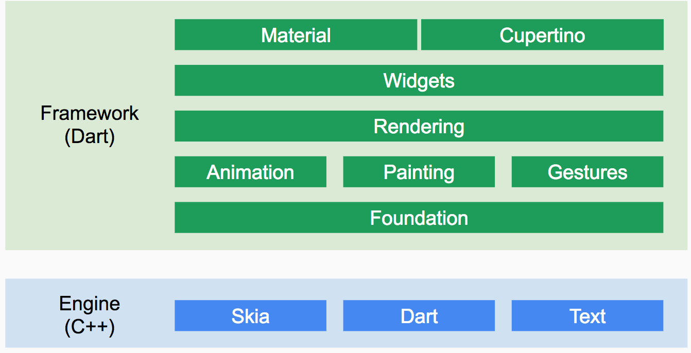
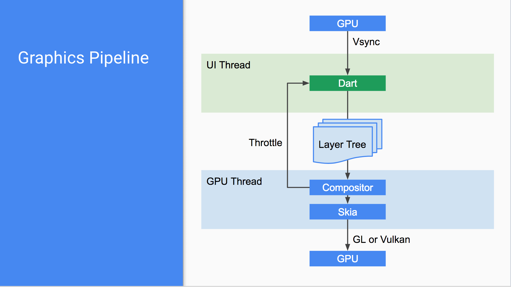

# 04Flutter简介
Flutter 是 Google推出并开源的移动应用开发框架，主打跨平台、高保真、高性能。开发者可以通过 Dart语言开发 App，一套代码同时运行在 iOS 和 Android平台,甚至可以运行在web端和pc端。

## 绘制原理
Flutter使用Skia作为其2D渲染引擎，Skia是Google的一个2D图形处理函数库，包含字型、坐标转换，以及点阵图都有高效能且简洁的表现，Skia是跨平台的，并提供了非常友好的API，目前Google Chrome浏览器和Android均采用Skia作为其绘图引擎。

Flutter使用自己的高性能渲染引擎来绘制UI，保证UI在Android和iOS上的一致性，亦降低开发成本。

## 编译模式
目前，程序主要有两种运行方式：静态编译与动态解释。

静态编译的程序在执行前全部被翻译为机器码，通常将这种类型称为AOT （Ahead of time）即 “提前编译”；而

解释执行的则是一句一句边翻译边运行，通常将这种类型称为JIT（Just-in-time）即“即时编译”。

AOT程序的典型代表是用C/C++开发的应用，它们必须在执行前编译成机器码，而JIT的代表则非常多，如JavaScript、python等，事实上，所有脚本语言都支持JIT模式。但需要注意的是JIT和AOT指的是程序运行方式，和编程语言并非强关联的，有些语言既可以以JIT方式运行也可以以AOT方式运行，如Java、Python，它们可以在第一次执行时编译成中间字节码、然后在之后执行时可以直接执行字节码，也许有人会说，中间字节码并非机器码，在程序执行时仍然需要动态将字节码转为机器码，是的，这没有错，不过通常我们区分是否为AOT的标准就是看代码在执行之前是否需要编译，只要需要编译，无论其编译产物是字节码还是机器码，都属于AOT。在此，读者不必纠结于概念，概念就是为了传达精神而发明的，只要读者能够理解其原理即可，得其神忘其形。

## Flutter架构

从该架构图可知，Flutter框架可分为Framework层和Engine层；

* Flutter Framework: 整个框架层都是用Dart语言实现，该层提供一套基础库， 用于处理动画、绘图和手势等。并且基于绘图封装了一套 UI组件库，并且细分为Materail和Cupertino两种风格的组件。
* Flutter Engine: 这是一个纯 C++实现的框架层，包含了 Skia引擎（高性能渲染引擎）、Dart运行环境、文字排版引擎等。它可以以 JIT、JIT Snapshot 或者 AOT(预先编译)的模式运行 Dart代码。AOT直接将Dart源码编译成了本地字节码，没有了解释执行的过程，提升执行性能。和Java显著不同的是Dart的"线程"(Isolate)是不共享内存的，各自的堆(Heap)和栈(Stack)都是隔离的，彼此之间通过消息通道来通信。所以，Dart不存在数据竞争和变量状态同步的问题，整个Flutter Framework Widget的渲染过程都运行在一个isolate中，在代码调用 dart:ui库时，提供 dart:ui库中 Native Binding 实现。 这个运行时还控制着 VSync信号的传递、GPU数据的填充等，并且还负责把客户端的事件传递到运行时中的代码。
